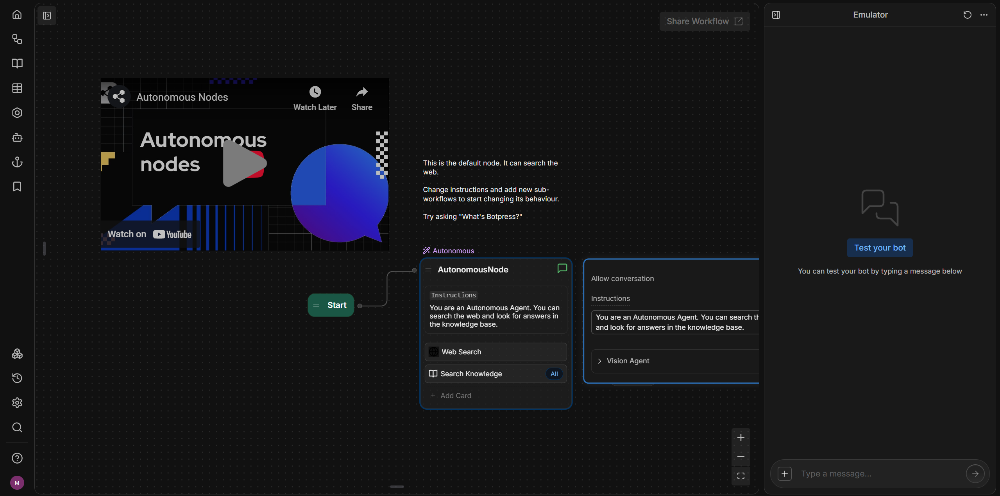

# Botpress

Welcome to the Botpress Workshop, organized by MTC and ACM-W! 🎉

Whether you're a complete beginner or have some experience, this workshop is designed to help you grasp the fundamentals of Botpress and kickstart your journey in chatbot development. By the end of the session, you'll have the skills to build your own interactive chatbot from scratch. Let's dive in and start building! 🚀

## What is Botpress?

Botpress is an open-source, low-code platform for building, managing, and deploying chatbots. It provides a visual interface to design chatbot workflows and integrates Natural Language Understanding (NLU) to process user inputs effectively.

Botpress is designed to be highly customizable and can be used to create AI-powered conversational agents for various applications, including customer support, automation, education, and interactive assistants.

## Account Setup and Bot creation 

Follow these simple steps to get started with bot building

- Visit [Botpress cloud](www.botpress.com) and hit sign up
- Sign up with your Google Account and verify your account
- You have now reached your workspace from where you can manage your chatbots
- Click "Create bot", then name your bot with a simple name and click Open in Studio
- You will be asked to choose a template. Ignore all the cool looking templates and click on Quick Start, as we will be building from scratch!
- Look for `Edit Main Flow` at the bottom of the page and click it

What you see on your screen now is Botpress Studio, where you'll be designing the workflow of your bot

## Some basic terms

Here are some basic terms to know before getting started

**Workspace** - The main environment in Botpress Studio, where you manage all your chatbots. It includes tools for building, testing, and deploying bots.

**Workflow** - A structured sequence of nodes and transitions that define how a chatbot interacts with users. It represents the chatbot's conversation logic.

**Nodes** - The building blocks of a workflow, each representing a step in the conversation. Nodes can contain messages, conditions, API calls, or actions. All nodes in your workflow will be between two nodes, start node and end node.

**Cards** - Elements inside a node that define specific actions, such as sending messages, capturing user input, or triggering integrations.

Now that you know these, lets start building!!

# Travel Website Chatbot

For this workshop, we will be building a chatbot for a travel blog. The remaining parts of this documentation is divided into sections, each named after the node we are using in the workflow.

## 

